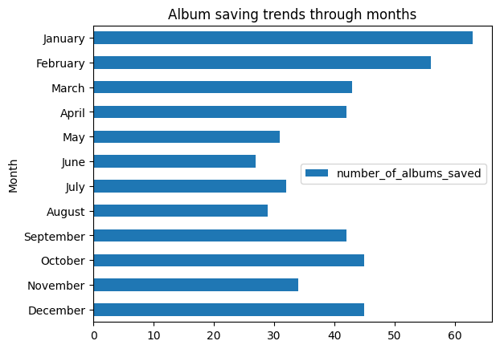
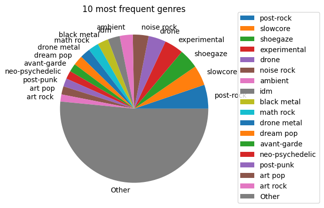

# Spotify Music Library Analysis
   
   Analysis of my personal Spotify library using [DuckDB](https://duckdb.org/) and SQL.

 
   
   ## Key Questions Explored
   - What were my album saving trends?
   - Which genres and tags dominate my collection?
   - Can we find similar artists to a given one?
   
   ## Technical Highlights
   - Complex SQL queries with window functions
   - Multi-table joins across artists/albums/tracks
   - DuckDB for efficient local analytics
   
   ## Setup
   If you want to try this notebook for yourself on your Spotify library, follow these steps:
   1. Clone the repository
```bash
git clone https://github.com/AlenkaJ/SpotifyShenanigans.git
cd SpotifyShenanigans
```
   2. Create the virtual environment and install requirements
```bash
python -m venv venv
source venv/bin/activate  # On Windows: venv\Scripts\activate
pip install -r requirements.txt
```
   3. Set up Spotify API credentials
      - Create an app at https://developer.spotify.com/dashboard
      - Create `.env` file with your credentials:
```
SPOTIPY_CLIENT_ID=your_client_id
SPOTIPY_CLIENT_SECRET=your_client_secret
SPOTIPY_REDIRECT_URI=http://localhost:8888/callback
```
   5. Initialize the database
```
python initialize_spotify_database.py
```
   7. Have fun with the notebooks :)
```bash
jupyter notebook
```

   ## Key findings
Through this analysis, I discovered:
- My library contains almost 500 albums from almost 400 artists across 160 genres with more than 600 tags
- I saved most albums in year 2023, followed by 2022, 2025 and 2024
- I saved most albums at the start of the year (January, February) and the least albums during summer (June, August)
- Top genres and tags include: post-rock, slowcore, shoegaze, experimental, electronic, ambient, indie
- Using genres and tags to search similar artists give significantly different results, which could indicate that using both helped to provide more information

   ## Tech Stack
   - Python 3.x
   - DuckDB
   - Spotipy (Spotify API)
   - Jupyter Notebook
   - Pandas

   This analysis led to building a full Django web app: [SpotifyDjangoApp](https://github.com/AlenkaJ/SpotifyDjangoApp).
